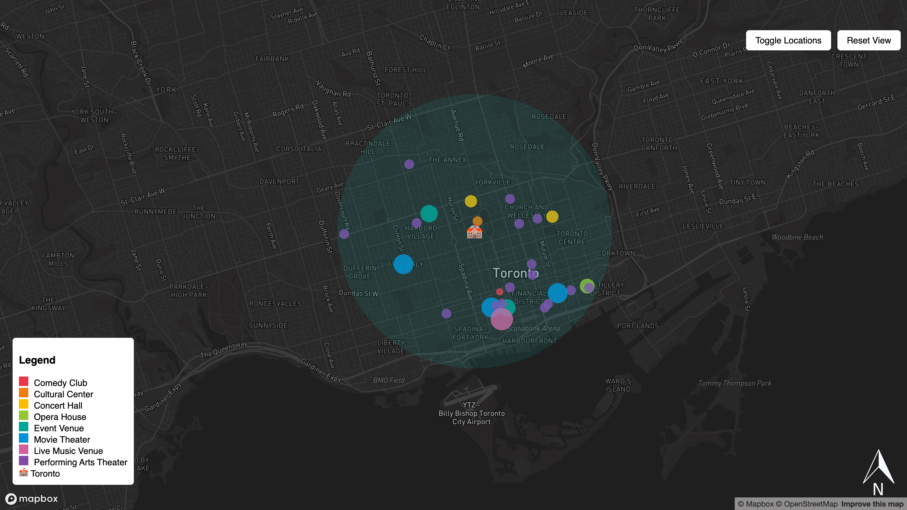

# ClassifiedEvent - Radiu3 Sound Story Web Map

**ClassifiedEvent** is an interactive **sound story web map** of Radiu3 that visualizes various cultural and entertainment venues within a **3km radius** of Toronto's center. It helps users discover event locations such as theaters, concert halls, opera houses, and more.

Check out the live web map here: https://zoezxrli.github.io/classifiedEvent/ 

---

## Features
**Interactive Map** – Built with **Mapbox GL JS** to provide smooth navigation.  
**Categorized Event Markers** – Different types of venues (e.g., concert halls, theaters) are color-coded for easy identification.  
**Dynamic School Icon** – The **University of Toronto** as the **center** location, which is marked with a **dynamic school icon**, which scales based on zoom level.  
**Hover & Click Effects** – Hovering highlights a location, while clicking opens a **popup** with venue details (name, type, phone number, and website).  
**GeoJSON 3km Radius** – Shows the coverage of event venues within a **3km walking distance**.  
**Toggle Visibility** – Users can **hide/show event markers** for a cleaner view.  
**Reset View Button** – Returns the map to its **default zoom and center** for easy navigation.  

---

## Hover & Click Features
**Hovering over a location temporarily highlights it in white.**
**Clicking a marker opens a popup with details:**
- Location Name
- Event Type
- Phone Number (Tel)
- Website Link
## Controls & UI Elements
Toggle Button – Hides or shows event locations.
Reset View – Resets the map to its original position.

